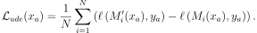
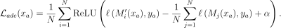
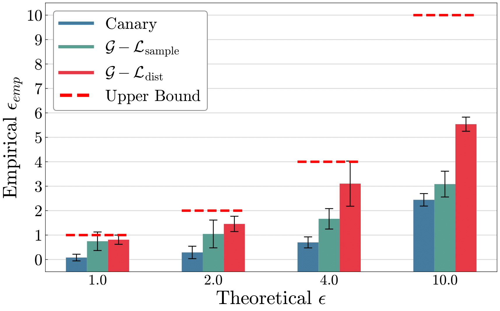
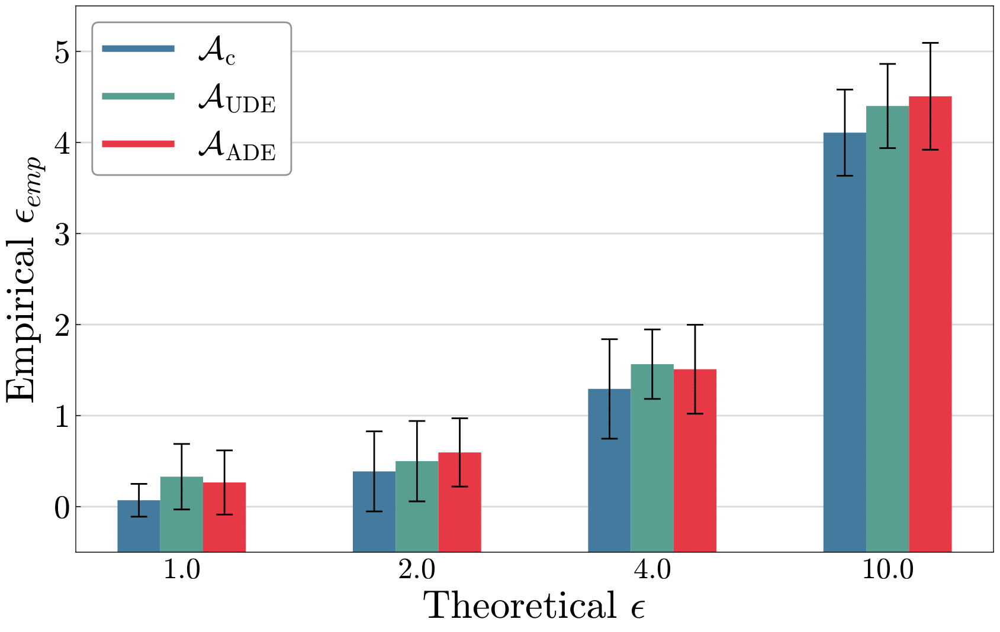

# Black-box Auditing of DP-SGD

## Install
Dependencies are managed by `conda/mamba`.  
Required dependencies can be installed using the command `conda env create -f env.yml` and then run `conda activate safety-audit`.  

## Training
To train a simple cnn model on the MNIST dataset with $\varepsilon = 10.0$ for privacy auditing, you can run the following command:
(More command line options can be found inside the `scripts/train_mnist.sh` file)
```bash
$ bash scripts/train_mnist.sh
```

## White-Box Auditing via Adversarial Sample 
After you have completed the pretraining phase of your model, you can perform a privacy leakage audit. The following command allows you to run input-space auditing using three different types of samples:

- Canary Sample: A known reference sample used to test for direct data leaks.
- **Uniform Distance Expansion** Sample (Ours): Optimized adversarial sample to ensure that models $M_i$ (model trained without canary) produce a higher loss and models $M'_i$ (model trained with canary) produce a lower loss when evaluating $a_w$, aiming to maximize the distinguishability between their output distributions.



- **Adaptive Distance Expansion** Sample (Ours): An advanced method that focuses solely on the overlapping regions of the loss distributions, avoiding training on already distinguishable values. This targeted approach improves the distinction between the distributions.


```bash
$ bash scripts/audit_mnist.sh
```

## Black-Box Auditing via Adversarial Sample
For black-box auditing, we first distill and create surrogate models of the testing models. Use following comments for this:
```bash
$ python3 surrogate_train.py
```
Then, run comments below for the black-box auditing. You will get results from three auditing samples (canary, ude, ade). Please refer to "White-Box auditing via Adversarial Samples for detail of the auditing samples."
```bash
$ bash scripts/black_audit_mnist.sh
```


## Results
<table>
  <tr>
    <td>
      <figure>
        
        <figcaption><strong>Figure 1:</strong> MNIST <em>white-box</em> results.</figcaption>
      </figure>
    </td>
    <td>
      <figure>
        
        <figcaption><strong>Figure 2:</strong> CIFAR10 <em>white-box</em> results.</figcaption>
      </figure>
    </td>
  </tr>
</table>

<figure>
  
  <figcaption><strong>Figure 3:</strong> MNIST <em>black-box</em> results.</figcaption>
</figure>


## Notes (From https://github.com/spalabucr/bb-audit-dpsgd)
1. We only consider full batch gradient descent, so $B = |D|$ always.
2. For DP-SGD, we sum the gradients instead of averaging them as the size of the dataset can leak information in add/remove DP (see [issue](https://github.com/pytorch/opacus/issues/571)). Therefore, learning rates are expressed in a non-standard way (as $\frac{\eta}{B}$ instead of just $\eta$) here. Specifically, when training a model on half of the MNIST dataset, $\eta = 4$ corresponds to a learning rate of $\frac{\eta}{B} = \frac{4}{30,000} = 1.33 \times 10^{-4}$ (see `scripts/model_init.sh`), which stays the same regardless of whether the dataset is $D$ or $D^-$.

## Reference
We followed the paper "Nearly Tight Black-Box Auditing of Differentially Private Machine Learning" for implementation of DP-SGD algorithm (https://github.com/spalabucr/bb-audit-dpsgd).
